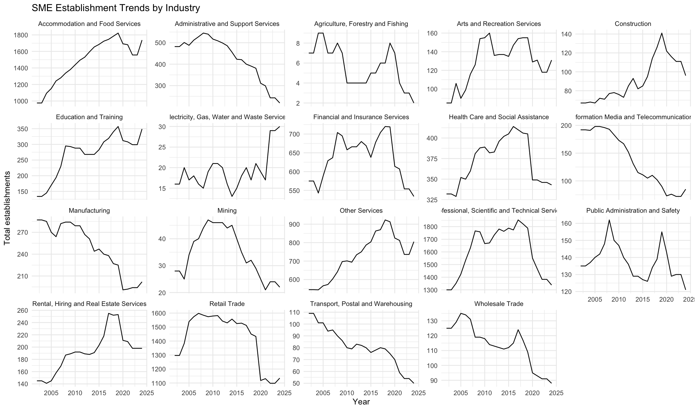

# BAC-Grp-1
# CMCE30005 Business Analytics Challenge
## [Your Team Name] - [Your Dataset Name]

**Subject:** CMCE30005 Business Analytics Challenge, Semester 2 2026
**University:** University of Melbourne
**Team Members:** [Name 1], [Name 2], [Name 3], [Name 4]
try
# CMCE30005 Business Analytics Challenge
## Sigma - Airbnb Melbourne - June 2026 Snapshot

**Subject:** CMCE30005 Business Analytics Challenge, Semester 2 2026
**University:** University of Melbourne
**Team Members:** [Teresa], [Ellen], [Wesley Kim], [Samuel Choong]

## CMCE30005-Sigma - Airbnb Melbourne - June 2026 Snapshot

**Subject:** CMCE30005 Business Analytics Challenge, Semester 2 2026
**University:** University of Melbourne
**Team Members:** Wesley, Sam, Teresa, Ellen !

---

## Business Problem

[Write your one-paragraph problem statement here. Include: who is the stakeholder,
what question you are answering, why it matters, and what methods you plan to use.]

---

## Dataset

**Dataset name:** Airbnb Melbourne - June 2026 Snapshot
**Source:** [e.g., Inside Airbnb - http://insideairbnb.com/]
**Coverage:** [e.g., All active Airbnb listings in Melbourne as of 16 June 2026]

### Data Files

| File | Description | Size |
|------|-------------|------|
| `business-establishments-with-address-and-industry-classification.csv` | Every individual business by location, address, and industry
classification, by census year | ~size MB |
| `business-establishments-and-jobs-data-by-business-size-and-anzsic.csv` | Aggregated counts of establishments and jobs by CLUE
area, industry sector, and business size class | ~size MB |

> **Note:** Data files are not committed to this repository due to size.
> Download from: [insert download URL or instructions]

this is r code so it wont show up when you try to run it, but it will show up if you preview at the top

---

*Last updated: 06/08/2026*
